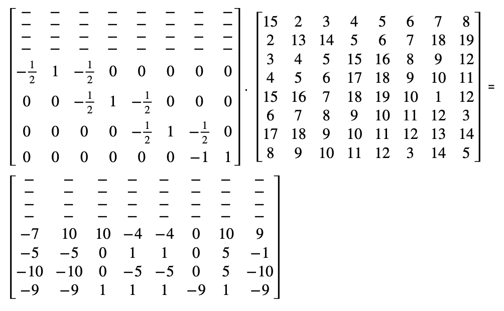

# Wavelet Transform
Source: http://www.whydomath.org/node/wavlets/hwt.html

## Introduction
If you have to transmit eight numbers `100, 200, 44, 50, 20, 20, 4, 2` in a limited bandwidth environment, and you are allowed to send only four values, how would you approximate the values that will be transmitted?
One obvious answer is to average each pair of numbers and represent them with one value. So this will produce `150, 47, 20, and 3`. This is an approximation of the values.

But using these values there is no way to recreate the original values. If we are allowed to transmit another set of four values which should help recreate the original values, then what values would we send? If the first set was average of values, then the second set can be the half of the distance between the pair of numbers. So this list will be 50, 3, 0, and -1. Using the first list and the second list we can recreate the original list by adding both the lists and by subtracting the lists. Addition: `150 + 50 = 200, 47 + 3 = 50, 20 + 0 = 20, and 3 + (-1) = 2`. Subtraction: `150 - 50 = 100, 47 - 3 = 44, 20 - 0 = 20, and 3 - (-1) = 4`.

So with the lists `(150,47,20,3)` and `(50,3,0,-1)`, we can completely reconstruct the original list `(100,200,44,50,20,20,4,2)`.

So why would we consider sending `(150,47,20,3 | 50, 3, 0, -1)` instead of `(100,200,44,50,20,20,4,2)`? Two reasons quickly come to mind. The differences in the transformed list tell us about the trends in the data - big differences indicate large jumps between values while small values tell us that there is relatively little change in that portion of the input. Also, if we are interested in lossy compression, then small differences can be converted to zero and in this way we can improve the efficiency of the coder. Suppose we converted the last three values of the transformation to zero. Then we would transmit `(150, 47, 20, 3 | 50, 0, 0, 0)`. The recipient could invert the process and obtain the list

`(150-50, 150+50, 47-0, 47+0, 20-0, 20+0, 3-0, 3+0) = (100, 200, 47, 47, 20, 20, 3, 3)`

The "compressed" list is very similar to the original list!

This is the basis of wavelet transform where we process a given set of data to separate out slow changing information from fast changing information and package is separately. The slow changing information is computed by taking average of values. The fast changing information is computed by taking differences. The slow changing information is also called ‘low pass’ values, as it as if the data is filtered through a low pass filter. The fast changing information is also called ‘high pass’ values, as it is as if the data is filtered through a high pass filter.

## Matrix Representation
For an even-length list (vector) of numbers, we can also form a matrix product that computes this transformation. For the sake of illustration, let's assume our list (vector) is length 8. If we put the averages as the first half of the output and differences as the second half of the output, then we have the following matrix product:

## Inverting the Process
Inverting is easy - if we subtract Y5 from Y1, we obtain V1. If we add Y5 and Y1, we obtain V2. We can continue in a similar manner adding and subtracting pairs to completely recover. We can also write the inverse process as a matrix product. We have:
 

# JPEG 2000
Source: http://www.whydomath.org/node/wavlets/jpeg2000wt.html

In the above example we were using pair of numbers (1/2, 1/2) and (-1/2, 1/2) as the low pass and high pass filters respectively. But using just 2 numbers as filters does not provide a good overview of the data, hence some higher length filters were developed which provide a good overview of the data.

JPEG 2000 uses a 5-3 integer filter known as LeGall filter pair for lossless image compression. This pair uses a 5 length filter for low pass and 3 length filter for high pass.

S stands for sum. D stands for difference.

Wim Sweldens developed a method for quickly computing the above transformation. His method is called lifting and it involves computing the highpass portion of the transformation and then <i>lifting</i> the lowpass portion from the highpass. The method is also useful since we can modify it to map integers to integers AND invert the process!

O = (O1, O2, O3, O4) = (V1, V3, V5, V7)

E = (E1, E2, E3, E4) = (V2, V4, V6, V8)

High pass: Dk = Ek – (Ok + Ok+1)/2, for every k = 1,2,3,4 where O5 = O4

Low Pass: Sk = Ok + (Dk-1 + Dk)/4, for every k = 1,2,3,4 where D0 = D1

So with <i>lifting</i> this would mean:

The inverse is computed as:

Ok = Sk – (Dk-1 + Dk)/4

Ek = Dk + (Ok + Ok+1)/2

JPEG 2000 uses a slight modification of this transform:

The inverse in JPEG 2000 is computed as:

# Example:

We will process the below matrix using the JPEG 2000 equations:

 
Step 1.a: First we process each column and compute the high pass (difference) values. We will use the below equation:

Step 1.b: In second step we will compute the low pass (sum) values by using the lifting equation

Second level of transform:
Step 2.a: In the second level of transform, we now process the rows and first compute the high pass (difference) values: 

Step 2.b: As part of this step we now compute the low pass (sum) values by lifting equation:

As an overview Step 1 converts the image from:

Step 2 converts the image from: 

